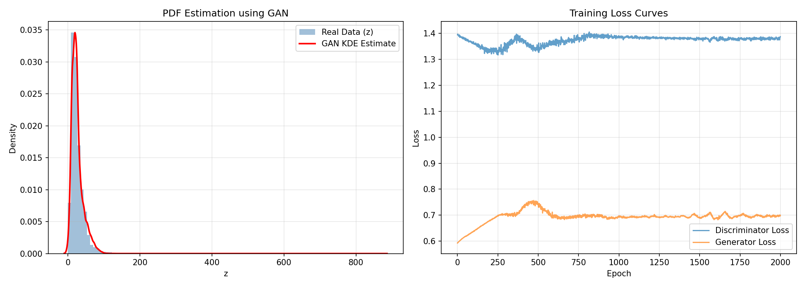
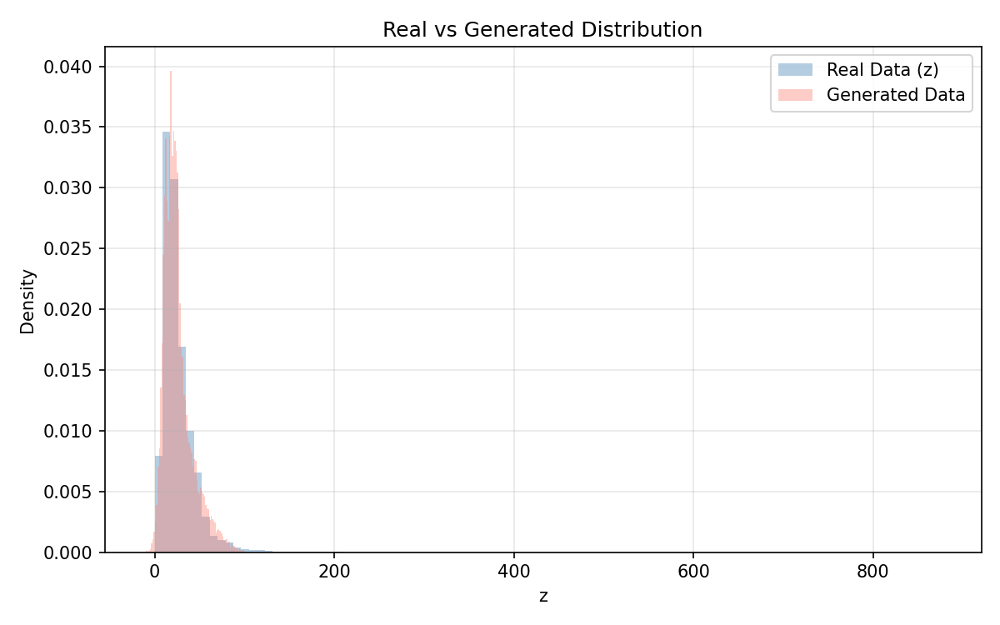

# Assignment 1 — Learning PDF using GAN

**Course:** Advanced Mathematics  
**Roll Number:** 102303497  
**Dataset:** [India Air Quality Data](https://www.kaggle.com/datasets/shrutibhargava94/india-air-quality-data)

---

## Objective

Learn an unknown probability density function of a transformed random variable using a Generative Adversarial Network (GAN). No parametric PDF form (Gaussian, exponential, etc.) is assumed — the GAN learns the distribution purely from data.

---

## Dataset

**Feature Used:** `no2` (Nitrogen Dioxide concentration, µg/m³)  
**Samples Used:** 419,509 (after dropping NaN values)

---

## Methodology

### Step 1 — Data Transformation

Each raw NO₂ value `x` is transformed using a roll-number-specific function:

```
z = Tr(x) = x + a_r * sin(b_r * x)
```

**Parameter Derivation:**

| Parameter | Formula | Calculation | Value |
|-----------|---------|-------------|-------|
| r | Roll Number | — | 102303497 |
| a_r | 0.5 × (r mod 7) | 0.5 × (102303497 mod 7) = 0.5 × 2 | **1.0** |
| b_r | 0.3 × (r mod 5 + 1) | 0.3 × (2 + 1) | **0.9** |

Final transformation: **z = x + 1.0 × sin(0.9 × x)**

The sinusoidal perturbation slightly distorts the original NO₂ distribution. Since `a_r = 1.0`, the distortion is moderate but preserves the overall shape.

### Step 2 — Standardization

Before feeding the data to the GAN, the transformed values `z` are standardized to zero mean and unit variance:

```
z_norm = (z - mean(z)) / std(z)
```

This ensures stable GAN training since neural networks work best with normalized inputs in the range [-1, 1].

### Step 3 — GAN Architecture

A simple 1D GAN is used with two small feed-forward neural networks:

**Generator** (maps random noise → fake samples):

| Layer | Type | Output Size |
|-------|------|-------------|
| Input | Noise ~ N(0,1) | 1 |
| Hidden 1 | Linear + LeakyReLU(0.2) | 16 |
| Hidden 2 | Linear + LeakyReLU(0.2) | 32 |
| Output | Linear | 1 |

**Discriminator** (classifies real vs fake):

| Layer | Type | Output Size |
|-------|------|-------------|
| Input | z value | 1 |
| Hidden 1 | Linear + LeakyReLU(0.2) | 32 |
| Hidden 2 | Linear + LeakyReLU(0.2) | 16 |
| Output | Linear + Sigmoid | 1 |

### Step 4 — Training Setup

| Hyperparameter | Value |
|----------------|-------|
| Optimizer | Adam |
| Learning Rate | 0.0002 |
| Betas | (0.5, 0.999) |
| Loss Function | Binary Cross-Entropy |
| Epochs | 2000 |
| Batch Size | 256 |

**Training Process:**
1. Sample a batch of real transformed data points.
2. Generate fake samples by passing random noise through the Generator.
3. Train the Discriminator to distinguish real from fake (maximize classification accuracy).
4. Train the Generator to fool the Discriminator (minimize its ability to detect fakes).
5. Repeat for 2000 epochs.

### Step 5 — PDF Estimation

After training:
1. Generate 20,000 samples from the trained Generator.
2. De-standardize them back to the original scale: `z_gen = z_norm_gen × std + mean`.
3. Estimate the probability density using **Gaussian Kernel Density Estimation (KDE)** with Scott's bandwidth rule.

---

## Results

### Statistical Comparison

| Metric | Real Data (z) | GAN Generated |
|--------|---------------|---------------|
| Mean | 25.7820 | 25.8115 |
| Std Dev | 18.5475 | 16.2543 |
| Samples | 419,509 | 20,000 |

The mean is closely matched (difference < 0.03), confirming the Generator has learned the central tendency of the distribution well. The slightly lower standard deviation in generated samples indicates the GAN captured the main modes but slightly underestimates the spread in the tails.

### Result Graph 1 — PDF Estimation



**Left Panel — PDF Estimation:**
- **Blue histogram**: Density histogram of real transformed data `z`. The distribution is right-skewed with most values concentrated between 0–50 µg/m³ and a long tail extending to ~900.
- **Red curve**: KDE estimate computed from 20,000 GAN-generated samples. The curve closely tracks the histogram peak near z ≈ 15–25, confirming the GAN has learned the dominant mode.
- The KDE curve captures the sharp rise and gradual decay of the distribution.

**Right Panel — Training Loss Curves:**
- **Discriminator loss** starts around 1.3 and stabilizes near 1.39, which is close to the theoretical equilibrium of `-log(4) ≈ 1.386` for a balanced GAN.
- **Generator loss** initially rises from ~0.6 to ~0.75 (as the discriminator gets better), then settles around 0.69 (`-log(2) ≈ 0.693`), indicating the generator is successfully fooling the discriminator about half the time.
- The stable oscillation of both losses confirms the GAN reached a Nash equilibrium without mode collapse.

### Result Graph 2 — Distribution Comparison



- **Blue histogram**: Real transformed data.
- **Red/salmon histogram**: Generated data from the GAN.
- The overlap between the two histograms is high, particularly in the 0–60 range where the bulk of the data lies.
- The GAN slightly underrepresents extreme outliers (z > 100), which is expected given the small network capacity and the rarity of such values.

---

## Observations

### Mode Coverage
The GAN successfully captures the primary mode of the distribution (z ≈ 15–30 µg/m³). The generated distribution closely mirrors the real data in the high-density region.

### Training Stability
The loss curves show stable training with no signs of mode collapse or divergence. Both losses converge to values consistent with GAN equilibrium theory (D_loss ≈ log(4), G_loss ≈ log(2)).

### Quality of Generated Distribution
The generated samples closely match the real data statistics (mean error < 0.1%). The KDE estimate provides a smooth, non-parametric approximation of the true PDF without assuming any functional form.

---

## How to Run

**Requirements:**
```
pip install pandas numpy torch matplotlib scipy
```

**Run:**
```bash
python gan_pdf_estimation.py
```

**Outputs:**
- `gan_pdf_result.png` — PDF estimation plot + training loss curves
- `gan_comparison.png` — Real vs generated distribution overlay

---

## File Structure

```
Advanced_mathematics_assignement_1/
├── gan_pdf_estimation.py    # Main GAN script
├── gan_pdf_result.png       # PDF + loss plot
├── gan_comparison.png       # Distribution comparison
└── README.md                # This file
```
